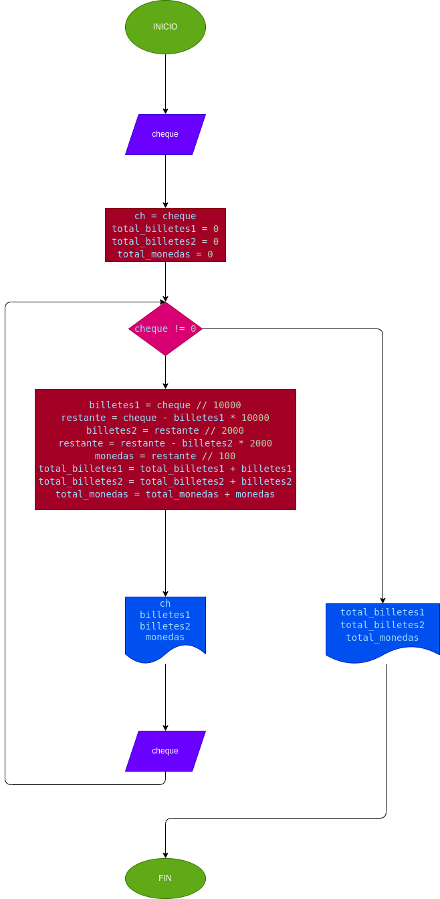

# CAJERO DE UN BANCO
El cajero de un banco solo dispone de billetes de $10000, $2000 y monedas de $100. Su función es cambiar los cheques a los clientes, dándoles el menor número posible de billetes. Asumiendo que todos los cheques son múltiples de $100, hacer el diagrama de flujo y el programa en Python que reciba el valor del cheque a cambiar y que le informe al cajero cuántos billetes de cada denominación debe entregar. Como no se sabe cuántos clientes vienen en un día, el programa debe terminar cuando reciba cero como valor del cheque, y al final del día debe informar cuántos billetes de cada denominación se gastaron.

## Análisis
Variables

    - total_billetes1 = 0 (Contador de billetes de $ 10.000)
    - total_billetes2 = 0 (Contador de billetes de $ 2.000)
    - total_monedas = 0 (Contador de monedas de $ 100)
    - ch = cheque (Renombrar la variable cheque para imprimirla)
    
Para este ejercicio se inicializan los totales de billetes y moneda que se han entregado en al día en cero (0), se solicita al usuario a ingresar el valor del cheque el cual debe ser multiplo de 100 para que el cajero pueda funcionar correctamente. El cajero debe entregar un reporte diario de cuantos billetes entrega, por ende, entra en un ciclo while donde el cajero revisa con unas operaciones matematicas la canidad de billetes o monedas que debe entregar de cada valor, las entrega y guarda el dato de cuanto entrego de cada valor y asi durante todo el día hasta que el se finalice el programa con un cero como valor de cheque, en este momento el cajero mostrara en pantalla cuantos billetes y monedas de cada designación se entregaron en el día.
    
## Diagrama de flujo

