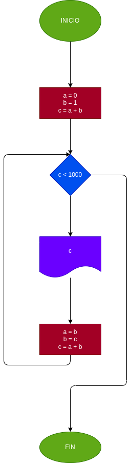

# SERIE FIBONACCI
La serie fibonacci es una secuencia numerica, en la cual cada elemento es igual a la suma de los dos anteriores. Tomando como variables iniciales los dos primeros elementos A = 0 y B = 1, hacer el diagrama de flujo y el programa en python, que calcule e imprima a partir del tercero, todos los elementos de la serie fibonnacci que sean menores que 1000.

## Análisis
Variables

    - a = 0
    - b = 1
    - c = a + b (Suma de los dos ultimos números)

Como la secuencia numerica fibonacci se obtiene sumando los ultimos dos numeros obtenidos asi que al momento de usar el ciclo while se realiza un cambio de variable con las letras 'a', 'b', 'c', para que al momento que vuelva a ingresar en el ciclo el valor de la variable 'a' sea el de 'b' y el valor de 'b' sea el de 'c' asi poder seguir sumando 'a + b'.

# Diagrama de flujo
