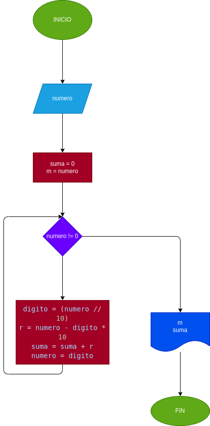

# SUMA DE DIGITOS
Hacer el diagrama de flujo y el programa en Python que lea un numero n, entero y positivo, de cualquier numero de digitos, que calcule la suma de sus digitos y que la imprima con el numero leido.

## Análisis 
Variables

    - numero = (Número que ingresa el usuario.)
    - m = numero (Para poder imprimir el número ingresado al final.)
    - suma = 0 (Esta variable va a ir sumando los resultados de los digitos.)
    - digito = (Aqui se hara la división entera entre 10.)
    - r = (Aqui se realizara la resta entre el numero y el digito obtenido multiplicado por 10.)
    - suma = (Inicializa en cero y se suma con r para ir sumando digito por digito.)
    - numero = digito (Para que el numero se convierta en digito que se extrajo anteriormente.)

El usuario ingresara un número 'n' positivo que entrara en un ciclo while que  tendra el comportamiento de dividir en 10 para obtener el ultimo digito del número, acto seguido resta el número con el número ontenido en la división entera entre 10 para asi darnos el ultimo digito, se suma el digito obtenido de la resta con la variable suma que inicia en cero; y este ciclo se repite hasta que la división por 10 sea cero.

## Diagrama de flujo
