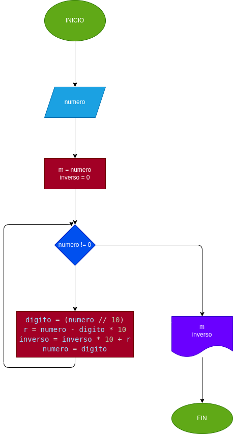

# INVERSO DEL NÚMERO
Hacer el diagrama de flujo y el programa en Python que lea un número entero y positivo de cualquier número de digitos, que calcule su número inverso y que lo imprima con el número leido.

## Análisis
variables

    - numero = (Número ingresado por el usuario.)
    - inverso = 0 (Se iran almacenando los números de manera inversa.)
    - m = numero (Renombrar la variable numero.)
    - digito = (El número ingresado dividido entero entre 10.)
    - r = (Numero menos el digito obtenido.)
    - inverso = (El inverso que inicializa en cero y lo multiplicamos por 10 y smamos la r.)
    - numero = digito (Le damos el valor del digito a la variable numero para que siga el proceso hasta que sea cero.)

El usuario ingresara un número de 'n' digitos el cual ingresara en un ciclo while donde se ectraera el ultimo digito mediante una división entera entre 10 y una resta entre el número ingresado y el digito que se obtuvo, para asi poder empezar a armar el inverso del número ingresado; esto se logra iniciando la variable 'inverso' en cero y multiplicandola por 10 y sumarle el digito obtenido en la resta 'r'.

## Diagrama de flujo
